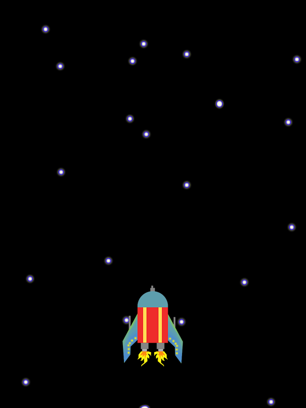

# Introduksjon {.intro}

For å programmere spill i Python, bruker vi et sett av programmerings-biblioteker kalt [PyGame](https://www.pygame.org/news). I denne oppgaven skal vi installere PyGame og tegne et romskip på skjermen.



# Steg 1: Installer PyGame {.activity}

Vi har brukt biblioteker tidligere, f.eks skilpaddebiblioteket, random-biblioteket osv. 

Disse bibliotekene følger med når du installerer Python, men det gjør ikke PyGame. Det må derfor installeres før vi kan bruke det. Den enkleste måten å gjøre dette på er å bruke pakkeverktøyet "pip". 

## Instruksjoner for Windows

Åpne et kommandolinje-vindu og skriv:

```
  python -m pip install pygame --user
```

Hvis du får en feilmelding om at "Finner ingen modul eller program som heter Python" (eller en tekst som likner), se på [denne siden](install_pip.html).

## Instruksjoner for Mac

Åpne Terminal og skriv:

```
  python3 -m pip install pygame --user
```

Forhåpentligvis skal du nå se noen streker fly over terminalvinduet ditt som viser at noe installeres.

# Steg 2: Sett opp vinduet {.activity}

- [ ] Lag et nytt python-program med følgende kode:

```python
import pygame

display_width = 600
display_height = 800

pygame.init()

gameDisplay = pygame.display.set_mode((display_width,display_height))
pygame.display.set_caption('Asteroid Run')

```

- [ ] Kjør programmet og se hva som skjer. Du skal nå få opp et svart vindu som er 600 piksler bredt og 800 piksler høyt. (Piksler er de små punktene på skjermen din).


